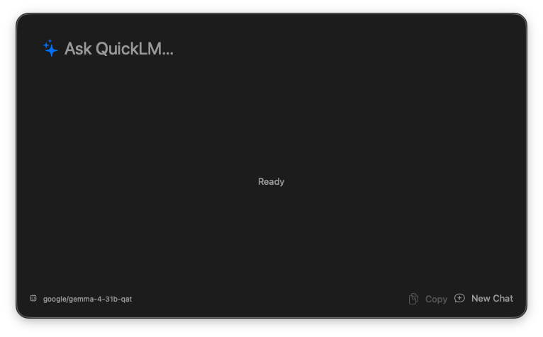

# QuickLM

QuickLM is a lightweight macOS menu bar application that provides a fast and seamless way to interact with local Large Language Models (LLMs) powered by LM Studio.



## Features

- **Quick Access**: Launch a prompt window instantly from your menu bar.
- **Local LLM Integration**: Connects to LM Studio's local server for private and fast inference.
- **Context Support**: Maintains conversation history within a session for continuous dialogue.
- **Customizable**: Configure the system prompt, temperature, and Base URL in the preferences.
- **Keyboard Shortcuts**: Set up custom hotkeys to open the prompt window quickly.
- **Markdown Support**: Responses are rendered in Markdown for better readability.

## Requirements

- macOS
- [LM Studio](https://lmstudio.ai/) installed and running with a model loaded and the local server started.

## Installation

1. Clone the repository:
   ```bash
   git clone https://github.com/fjasensi/QuickLM.git
   ```
2. Open `gpt_action.xcodeproj` in Xcode.
3. Build and run the application.

## Usage

1. Open LM Studio and start the local server.
2. Launch QuickLM.
3. Use the menu bar icon or your configured hotkey to open the "Quick Ask" window.
4. Type your question and press Enter.
5. Use "New Chat" to clear the conversation context.
